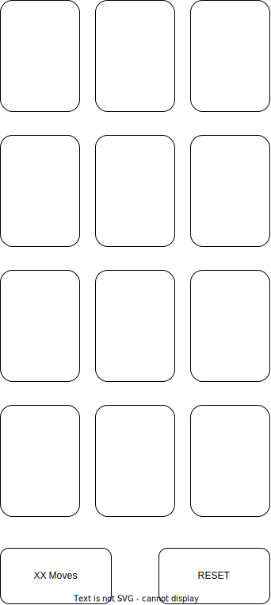

# reversalGame

Wireframe: https://wireframe.cc/RPyp6G

## Purpose

The project is intended to be a simple browser-based game of memory. \
I will use the as a training tool for connecting on-click events on graphics interfaces (the cards) with simple data handling to see if the player managed to guess and/or remember correctly.

## User Stories

* I want to see an interface with twelve cards distributed in a uniform fashion 
* When I click any card, that card should flip to show its identifier (image or number)

* When I click a second card, that card should also flip
* Matching:
    * If the identities of the two clicked cards match, the player should be awarded a "Match!" prompt
    * If the two cards' identities do not match, both cards should flip back to the face down position
* Scores:
    * The player should be allowed to play for an infinite time
    * The game should count the players' number of moves
        * Fewer moves = better
        * Comparing two cards = one move