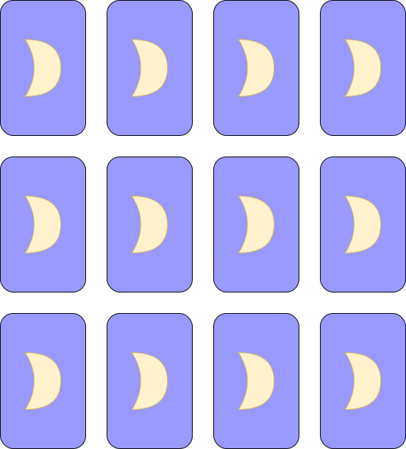

# reversalGame
 

The project aims to create a simple game of memory, which can be played in the browser. The first iteration will be a static page, while a later version will implement the ability to submit the player's score to a highscore table.

## Purpose

The game's purpose is to train familiarity with state handling and in utilizing a card's individual state to feed information to the game's algorithm.

## User Stories

* I want to see an interface with twelve cards distributed in a uniform fashion 
* When I click any card, that card should flip to show its identifier (image or number)

* When I click a second card, that card should also flip, and matching be resolved
* Match resolve:
    * If the identities of the two clicked cards match, the player should be awarded a "Match!" prompt, and the cards should disappear
    * If the two cards' identities do not match, both cards should flip back to the face down position
* Scores:
    * The player should be allowed to play for an infinite time
    * The game should count the players' number of moves
        * Fewer moves are better
        * Comparing two cards equal one move

# Proposed Logic
I would like to use logic which can be extended to essentially any even number of cards. 

## Card properties
n pairs make up the total of 2n cards. \
Each card must at minimum have a unique identifier, a pair identifier, an image to display on flip, and a flipped? boolean state. \
The unique identifier will be used to assign the card to a random space on the board. \
The pair identifier will be assigned randomly, and the card's image will be tied to this.

## State

## Algorithm